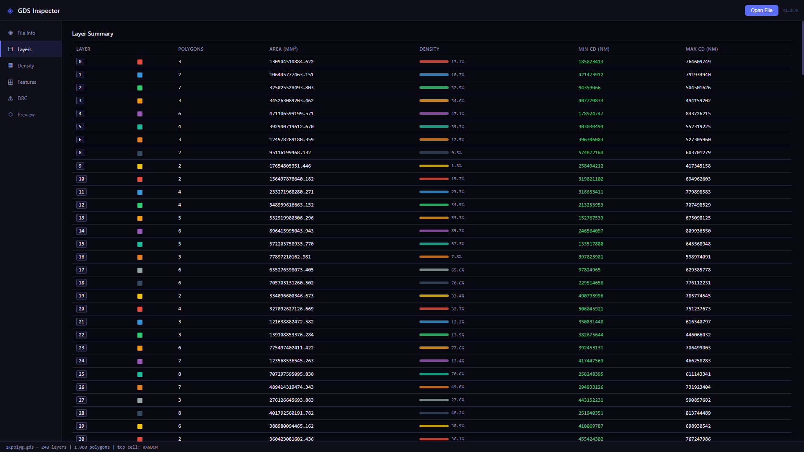
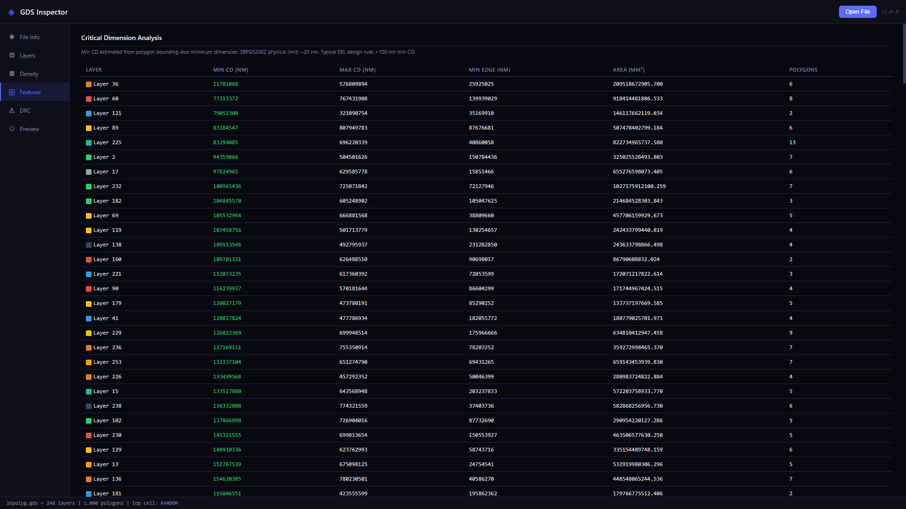
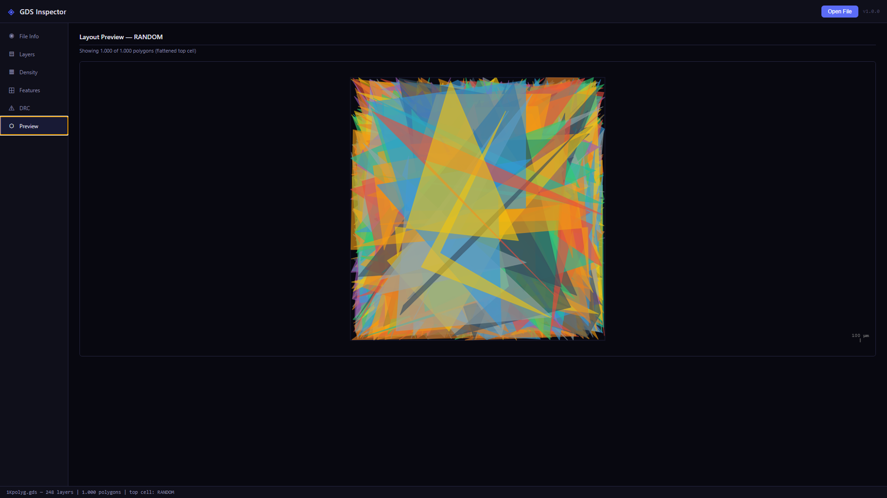

# GDS Inspector

[](https://github.com/OutBlade/gds-inspector/releases/latest)
[](https://github.com/OutBlade/gds-inspector/actions)
[](https://github.com/OutBlade/gds-inspector/releases/latest)
[](LICENSE)

Professional GDSII layout analysis tool for nanofabrication engineers. Built for daily EBL workflows: inspect layer structure, calculate pattern density, analyze critical dimensions, and run design rule checks — all in a fast, offline desktop app.

---

## Download

**[Download GDS Inspector for Windows](https://github.com/OutBlade/gds-inspector/releases/latest)**

The installer is self-contained. No Python installation required.

---

## Screenshots

**Layer Summary** — all layers with polygon counts, covered area, inline density bars, and color-coded minimum CD values.



**Critical Dimension Analysis** — minimum and maximum feature sizes per layer, sorted by min CD. Values below 100 nm are flagged in red for immediate visibility before tape-out.



**Layout Preview** — 2D canvas rendering of the flattened top cell with per-layer colors and a calibrated scale bar. Supports up to 3,000 polygons without performance issues.



---

## Features

**Layer Inspector** — view all layers with polygon counts, covered area, and color-coded indicators.

**Pattern Density** — per-layer density relative to the top-cell bounding box. Critical for EBL proximity effect correction on the EBPG5200Z and similar tools.

**Critical Dimension Analysis** — minimum and maximum feature sizes per layer. Flags structures below 100 nm with color-coded severity for quick review before tape-out.

**Design Rule Check (DRC)** — automated check for minimum width and minimum area violations with configurable thresholds. Shows violation location and cell name.

**Layout Preview** — 2D canvas rendering of the flattened top cell with correct layer colors and a calibrated scale bar.

**Auto-Update** — detects and installs new versions silently in the background.

---

## Supported Formats

GDSII binary format: `.gds`, `.gds2`, `.gdsx`

---

## Python Backend

The analysis engine is written in Python using [gdstk](https://heitzmann.github.io/gdstk/), a high-performance GDSII/OASIS library.

```
gds_inspector/
  inspector.py   — layer analysis, density, CD extraction
  drc.py         — min-width and min-area design rule checks
```

### Run from source

```bash
pip install -r requirements.txt
python backend_main.py path/to/layout.gds
```

### Run tests

```bash
pytest tests/ -v
```

---

## Build from Source

Prerequisites: Python 3.11+, Node.js 20+

```bash
# 1. Build Python backend
pip install -r requirements.txt pyinstaller
python generate_icon.py
pyinstaller --onedir --name gds_backend backend_main.py
copy dist\gds_backend desktop\resources\gds_backend

# 2. Build Electron installer
cd desktop
npm install
npm run build
```

The installer will be in `desktop/dist/`.

---

## Tech Stack

| Layer | Technology |
|---|---|
| Layout parsing | gdstk (C++ GDSII library) |
| DRC engine | Python (polygon geometry) |
| Desktop shell | Electron 28 |
| Packaging | PyInstaller + electron-builder |
| CI/CD | GitHub Actions |

---

## License

MIT
