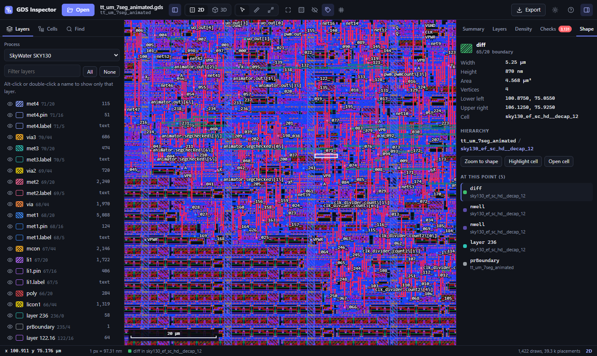
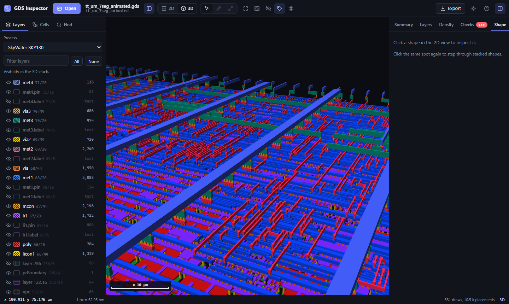
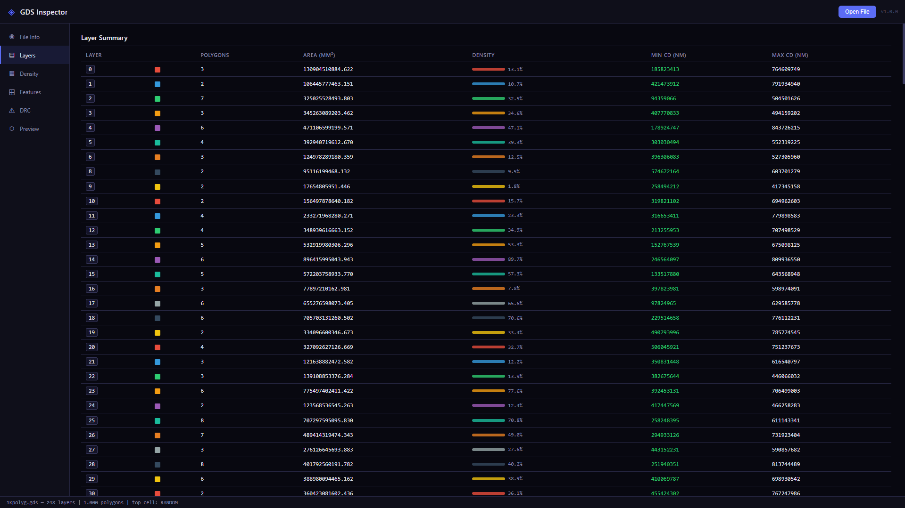
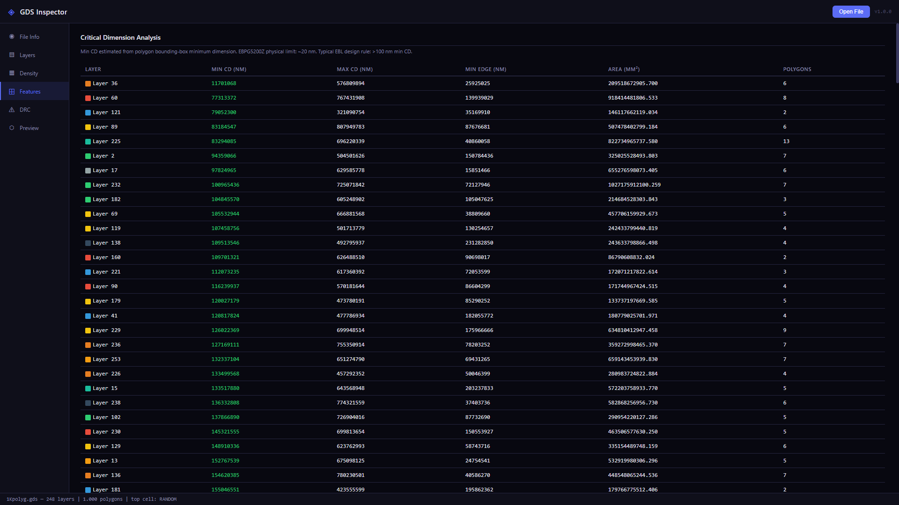
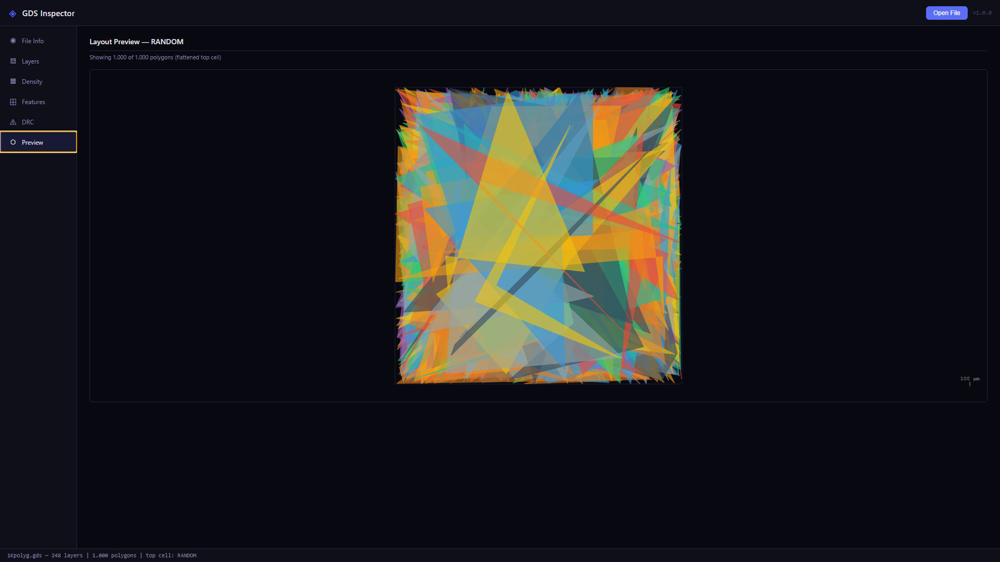

# GDS Inspector

<!-- project-navigation -->
[Web app](#web-app) · [IDE extension](#ide-extension) · [Getting started](#build-from-source) · [Features](#features)
<!-- /project-navigation -->

[](https://github.com/OutBlade/gds-inspector/releases/latest)
[](https://github.com/OutBlade/gds-inspector/actions)
[](https://github.com/OutBlade/gds-inspector/releases/latest)
[](LICENSE)

Free, open-source GDS/GDSII layout viewer and analysis tool for ASIC, VLSI and nanofabrication workflows. Explore chip layouts in 2D and 3D in the browser, in VS Code or Cursor, or in the Windows desktop app. Inspect layers, measure features and analyze pattern density with local file processing.

---

## Web app

**[Open GDS Inspector in the browser](https://outblade.github.io/gds-inspector/)**

The same analysis, plus a full layout viewer, with nothing to install. Files are read inside the browser tab and never uploaded.





- **2D view**: hatched layers in KLayout style, full hierarchy with instancing, level of detail for millions of placements, labels, grid and scale bar.
- **3D view**: extruded metal stack with adjustable height, exploded layers and a section cut.
- **Process aware**: recognises SKY130, GF180MCU and IHP SG13G2 layer maps; imports KLayout `.lyp` files for any other process.
- **Inspect**: click a shape for its size, area and hierarchy path; click again to step through stacked shapes. Cell tree with highlight, hide and open as top; search over labels and cell names; a gallery of all top cells for standard cell libraries.
- **Measure**: snapping ruler and cross-section profiles along any line.
- **Analyse**: per-layer placed area, true coverage density maps, minimum widths, rule checks with markers, EBL beam-on time.
- **Share**: `?url=` opens a remote GDS file, the view position is kept in the address. Export PNG, SVG, the JSON report (same format as the desktop app) and a layer CSV.

Keyboard: `1` hides fill, decap and tap cells, `2` hides top cell geometry, `3` highlights the selected cell, `4` zooms to the selection (as in the Tiny Tapeout viewer), `T` switches 2D and 3D, `R` ruler, `X` cross-section, `?` lists the rest.

Run it locally:

```bash
cd web
npm install
npm run dev
```

`npm test` runs the unit tests. The CI parity job writes a fixture with gdstk and checks that the browser port reports exactly what `gds_inspector/inspector.py` reports.

---

## IDE extension

GDS Inspector also runs inside VS Code, Cursor, Windsurf, VSCodium and other editors built on VS Code. Click a `.gds` file and it opens in the layout view instead of a binary text warning.

**Install**: download `gds-inspector-*.vsix` from the [latest extension release](https://github.com/OutBlade/gds-inspector/releases?q=vscode), then in the editor open the Extensions view, the `...` menu, **Install from VSIX**, and pick the file. From a terminal:

```bash
code --install-extension gds-inspector-0.1.0.vsix
```

(`cursor`, `windsurf` and `codium` take the same flag.)

- Opens `.gds`, `.gds2`, `.gdsii`, `.gdsx` and `.gds.gz` files, also in remote, WSL and container workspaces.
- Follows the editor's light or dark theme.
- Reloads in place when the file changes on disk, so rerunning a layout flow updates the open view.
- Applies a KLayout `.lyp` that sits next to the layout, or the one set in `gdsInspector.layerProperties`.
- Command palette: **GDS Inspector: Open Layout** and the four exports (PNG, SVG, JSON report, layer CSV).

Develop: `cd vscode && npm install && npm test` builds the web app into the extension and runs the integration tests in a downloaded VS Code.

Store publishing is automated: pushing a tag `vscode-v<version>` builds, tests and attaches the `.vsix` to a GitHub release, and also publishes to the VS Code Marketplace and to Open VSX (used by VS Code-family editors; Cursor applies its own marketplace review) once the repository secrets `VSCE_PAT` and `OVSX_PAT` exist.

---

## Download

**[Download GDS Inspector for Windows](https://github.com/OutBlade/gds-inspector/releases/latest)**

The installer is self-contained. No Python installation required.

---

## Screenshots

**Layer Summary** — all layers with polygon counts, covered area, inline density bars, and color-coded minimum CD values.



**Critical Dimension Analysis** — minimum and maximum feature sizes per layer, sorted by min CD. Values below 100 nm are flagged in red for immediate visibility before tape-out.



**Layout Preview** — 2D canvas rendering of the flattened top cell with per-layer colors and a calibrated scale bar. Supports up to 3,000 polygons without performance issues.



---

## Features

**Layer Inspector** — view all layers with polygon counts, covered area, and color-coded indicators.

**Pattern Density** — per-layer density relative to the top-cell bounding box. Critical for EBL proximity effect correction on the EBPG5200Z and similar tools.

**Critical Dimension Analysis** — minimum and maximum feature sizes per layer. Flags structures below 100 nm with color-coded severity for quick review before tape-out.

**Design Rule Check (DRC)** — automated check for minimum width and minimum area violations with configurable thresholds. Shows violation location and cell name.

**Layout Preview** — 2D canvas rendering of the flattened top cell with correct layer colors and a calibrated scale bar.

**Auto-Update** — detects and installs new versions silently in the background.

---

## Supported Formats

GDSII binary format: `.gds`, `.gds2`, `.gdsx`

---

## Python Backend

The analysis engine is written in Python using [gdstk](https://heitzmann.github.io/gdstk/), a high-performance GDSII/OASIS library.

```
gds_inspector/
  inspector.py   — layer analysis, density, CD extraction
  drc.py         — min-width and min-area design rule checks
```

### Run from source

```bash
pip install -r requirements.txt
python backend_main.py path/to/layout.gds
```

### Run tests

```bash
pytest tests/ -v
```

---

## Build from Source

Prerequisites: Python 3.11+, Node.js 20+

```bash
# 1. Build Python backend
pip install -r requirements.txt pyinstaller
python generate_icon.py
pyinstaller --onedir --name gds_backend backend_main.py
copy dist\gds_backend desktop\resources\gds_backend

# 2. Build Electron installer
cd desktop
npm install
npm run build
```

The installer will be in `desktop/dist/`.

---

## Tech Stack

| Layer | Technology |
|---|---|
| Layout parsing | gdstk (C++ GDSII library) |
| DRC engine | Python (polygon geometry) |
| Desktop shell | Electron 28 |
| Packaging | PyInstaller + electron-builder |
| CI/CD | GitHub Actions |

---

## License

MIT
